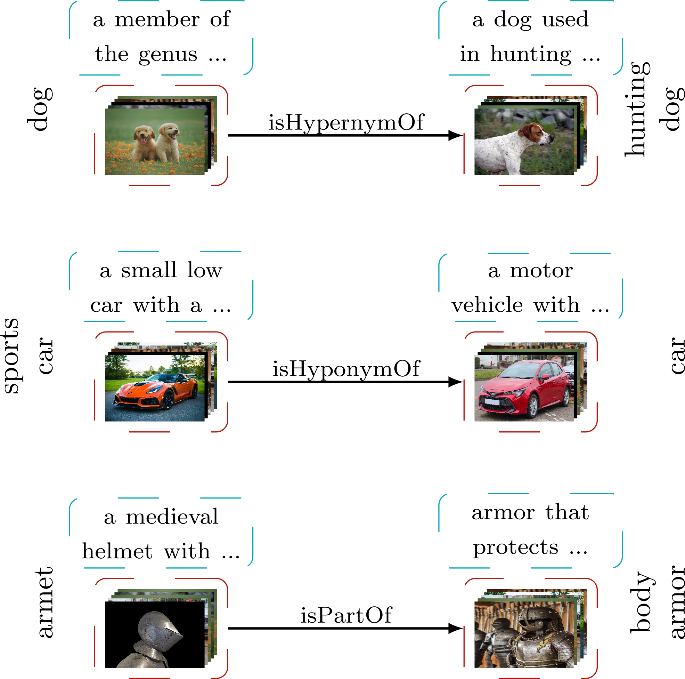
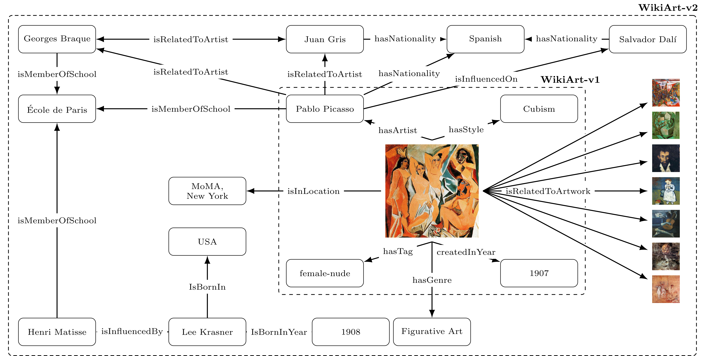

# VL-KGE: Vision-Language Models Meet Knowledge Graph Embeddings

[](https://www.python.org/downloads/)
[](https://pytorch.org/)
[](LICENSE)

Official PyTorch implementation of **"VL-KGE: Vision-Language Models Meet Knowledge Graph Embeddings"** by Athanasios Efthymiou, Stevan Rudinac, Monika Kackovic, Nachoem Wijnberg, and Marcel Worring (University of Amsterdam).

## Overview

VL-KGE is a multimodal knowledge graph embedding framework that integrates pretrained vision-language representations (CLIP, BLIP) with traditional KGE methods (TransE, DistMult, ComplEx, RotatE) to learn unified representations of entities across visual, textual, and structural modalities.

  
*Figure 1: Example triples from WN9-IMG. Entities correspond to ImageNet synsets with images (red) and WordNet textual definitions (cyan), connected by semantic relations.*

### Key Features

- **Multimodal Integration:** Combines visual features, textual descriptions, and graph structure
- **Cross-Modal Alignment:** Leverages pretrained vision-language models (CLIP, BLIP) for aligned representations
- **Modality Asymmetry:** Explicitly handles entities with different modality combinations
- **Inductive Learning:** Generates embeddings for unseen entities without retraining
- **Flexible Architecture:** Compatible with multiple KGE backbones (TransE, DistMult, ComplEx, RotatE)
- **Three Datasets:** Includes WN9-IMG and two new fine-art knowledge graphs


*Figure 2: Example subgraphs from WikiArt-MKG-v1 and WikiArt-MKG-v2. Artworks are represented visually, while associated entities (artists, styles, genres, locations) are represented textually.*

## Installation

### Requirements

- Python 3.8+
- PyTorch 2.0+
- CUDA 11.0+ (for GPU support)

### Setup
```bash
# Clone the repository
git clone https://github.com/thefth/vlkge.git
cd vlkge

# Install dependencies
pip install -r requirements.txt

# Install in development mode (optional)
pip install -e .
```

## Quick Start

### Training on WN9-IMG
```bash
# Using config file (recommended)
python scripts/train.py --config configs/wn9_img/transe_clip.yaml

# Using command line arguments
python scripts/train.py \
    --dataset wn9_img \
    --model TransE \
    --use_structural --use_visual --use_textual \
    --epochs 200 \
    --batch_size 512
```

### Training on WikiArt-MKG-v2
```bash
python scripts/train.py --config configs/wikiart_mkg_v2/distmult_clip.yaml
```

### Custom Dataset
```bash
python scripts/train.py \
    --dataset my_dataset \
    --data_path /path/to/triples.csv \
    --visual_features_path /path/to/visual.pkl \
    --textual_features_path /path/to/textual.pkl \
    --model ComplEx \
    --epochs 100
```

## Datasets

### WN9-IMG

WordNet-based multimodal KG where entities correspond to ImageNet synsets with both visual and textual features.

- **Entities:** 6,555
- **Relations:** 9
- **Triples:** 11,741 (train) / 1,337 (val) / 1,319 (test)
- **Modality:** All entities have both visual and textual features

### WikiArt-MKG-v1

Fine-art knowledge graph modeling artworks and their attributes (artists, styles, tags, years).

- **Entities:** 76,758 (75,921 artworks, 837 attributes)
- **Relations:** 4
- **Triples:** 299,968 (train) / 34,020 (val) / 19,695 (test)
- **Modality Asymmetry:** Artworks have visual features, attributes have textual features

### WikiArt-MKG-v2

Large-scale fine-art knowledge graph with enriched metadata and artist-to-artist relations.

- **Entities:** 224,166 (216,564 artworks, 7,602 attributes)
- **Relations:** 22
- **Triples:** 7,877,220 (train) / 208,513 (val) / 208,368 (test)
- **Modality Asymmetry:** Complex entity-type dependent modality combinations

See [data/README.md](vlkge/data/README.md) for detailed dataset descriptions.

## Results

### WN9-IMG

| Model | MRR | Hits@1 | Hits@3 | Hits@10 |
|-------|-----|--------|--------|---------|
| TransE (Structural) | 0.904 | 0.894 | 0.909 | 0.922 |
| **VL-TransE (CLIP)** | **0.913** | **0.890** | **0.928** | **0.950** |
| DistMult (Structural) | 0.904 | 0.902 | 0.904 | 0.907 |
| **VL-DistMult (CLIP)** | **0.935** | **0.925** | **0.940** | **0.957** |
| ComplEx (Structural) | 0.900 | 0.899 | 0.901 | 0.902 |
| **VL-ComplEx (CLIP)** | **0.927** | **0.920** | **0.929** | **0.941** |
| RotatE (Structural) | 0.910 | 0.907 | 0.911 | 0.917 |
| **VL-RotatE (CLIP)** | **0.914** | **0.904** | **0.918** | **0.934** |

### WikiArt-MKG-v1

| Model | MRR | Hits@1 | Hits@3 | Hits@10 |
|-------|-----|--------|--------|---------|
| Zero-shot CLIP | 0.510 | 0.357 | 0.609 | 0.798 |
| **VL-TransE (CLIP)** | 0.683 | 0.535 | 0.799 | 0.938 |
| **VL-DistMult (CLIP)** | 0.781 | 0.659 | 0.888 | 0.974 |
| **VL-ComplEx (CLIP)** | **0.785** | **0.665** | **0.889** | **0.975** |
| **VL-RotatE (CLIP)** | 0.724 | 0.590 | 0.833 | 0.950 |

### WikiArt-MKG-v2

| Model | MRR | Hits@1 | Hits@3 | Hits@10 |
|-------|-----|--------|--------|---------|
| Zero-shot CLIP | 0.237 | 0.139 | 0.263 | 0.442 |
| **VL-TransE (CLIP)** | 0.526 | 0.399 | 0.597 | 0.772 |
| **VL-DistMult (CLIP)** | 0.577 | 0.462 | 0.643 | 0.796 |
| **VL-ComplEx (CLIP)** | **0.578** | **0.465** | **0.642** | 0.795 |
| **VL-RotatE (CLIP)** | 0.439 | 0.326 | 0.489 | 0.667 |

VL-KGE demonstrates substantial improvements over zero-shot baselines, especially on modality-asymmetric datasets where it achieves more than 2x improvement in MRR.

## Project Structure
```
vlkge/
├── configs/                 # YAML configuration files
│   ├── wn9_img/
│   │   ├── transe_clip.yaml
│   │   ├── distmult_clip.yaml
│   │   ├── complex_clip.yaml
│   │   └── rotate_clip.yaml
│   ├── wikiart_mkg_v1/
│   │   ├── complex_clip.yaml
│   │   └── rotate_clip.yaml
│   └── wikiart_mkg_v2/
│       ├── distmult_clip.yaml
│       └── rotate_clip.yaml
├── data/                   # Datasets and features
│   ├── README.md
│   ├── wn9_img/
│   │   ├── README.md
│   │   ├── wn9_img_triples.csv
│   │   └── features/
│   ├── wikiart_mkg_v1/
│   │   ├── README.md
│   │   ├── wikiart_mkg_v1_triples.csv
│   │   └── features/
│   └── wikiart_mkg_v2/
│       ├── README.md
│       ├── wikiart_mkg_v2_triples.csv
│       └── features/
├── models/                 # KGE model implementations
│   ├── __init__.py
│   ├── vlkge.py           # Base VL-KGE class
│   ├── transe.py
│   ├── distmult.py
│   ├── complex.py
│   └── rotate.py
├── scripts/                # Training and evaluation scripts
│   ├── train.py
│   ├── evaluate_linear_probe.py
│   ├── evaluate_relatedto.py
│   └── evaluate_zero_shot.py
├── dataloader.py           # Data loading utilities
├── helpers.py              # Training helpers
├── utils.py                # Utility functions
├── __init__.py
├── requirements.txt
├── LICENSE
└── README.md
```

## Configuration Files

All experiments can be reproduced using the provided YAML configuration files in `configs/`. Each config specifies:

- Dataset paths and features
- Model architecture and hyperparameters
- Training settings
- Evaluation protocol


## Key Contributions

1. **VL-KGE Framework:** Novel integration of pretrained vision-language models with symbolic relational modeling
2. **Modality Asymmetry Handling:** Explicit support for heterogeneous entities with different modality combinations
3. **WikiArt-MKG-v2 Dataset:** Large-scale fine-art knowledge graph with 224K entities and 22 relation types
4. **Inductive Learning:** Support for zero-shot inference on unseen entities
5. **Comprehensive Evaluation:** Extensive experiments demonstrating substantial improvements over baselines

## Citation

If you use this code or datasets in your research, please cite:
```bibtex
@inproceedings{efthymiou2025vlkge,
  title={VL-KGE: Vision-Language Models Meet Knowledge Graph Embeddings},
  author={Efthymiou, Athanasios and Rudinac, Stevan and Kackovic, Monika and Wijnberg, Nachoem and Worring, Marcel},
  year={2025},
}
```

## License

This project is licensed under the MIT License - see the [LICENSE](LICENSE) file for details.

## Contact

For questions or issues, please open an issue on GitHub or contact:
- Athanasios Efthymiou (a.efthymiou@uva.nl)